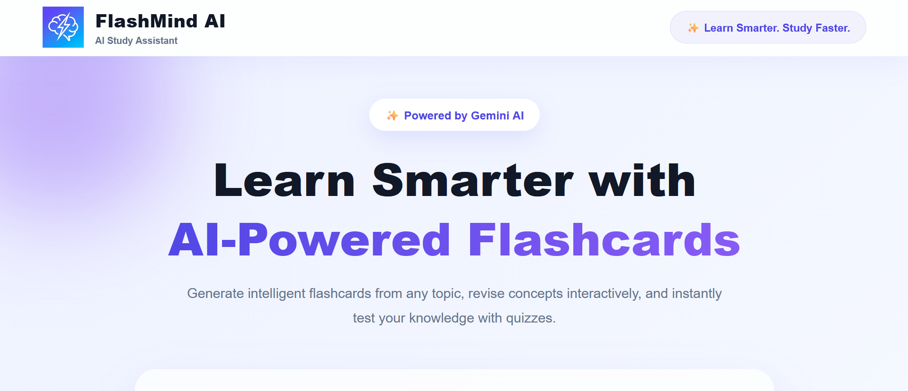
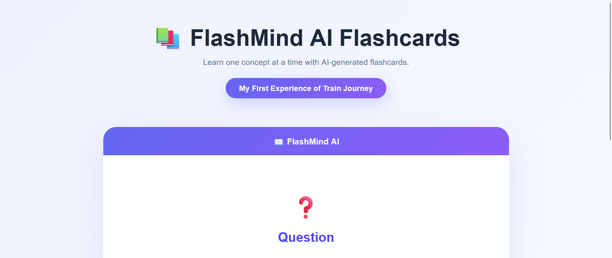
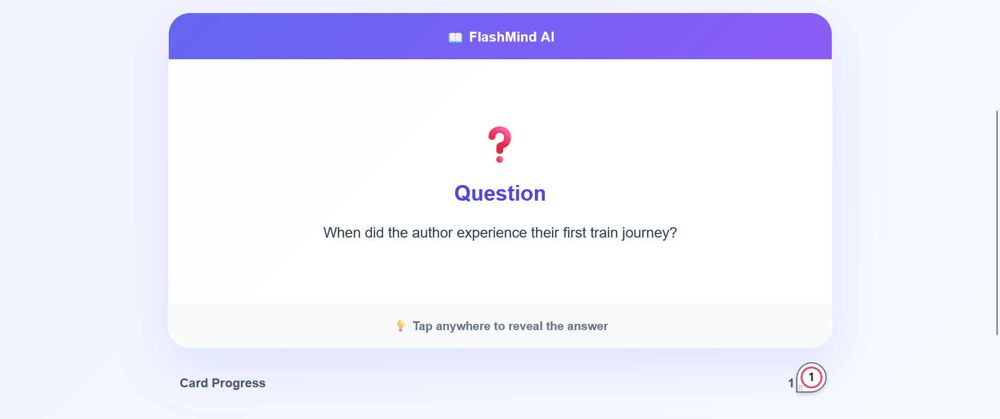
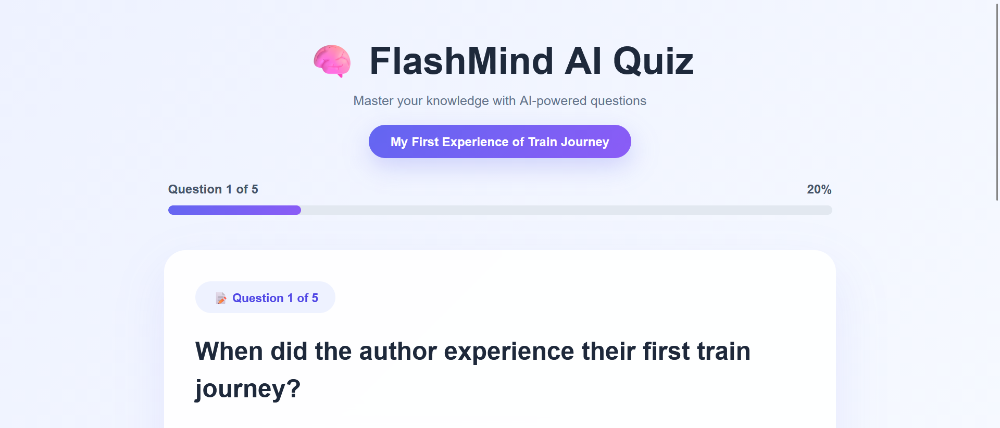
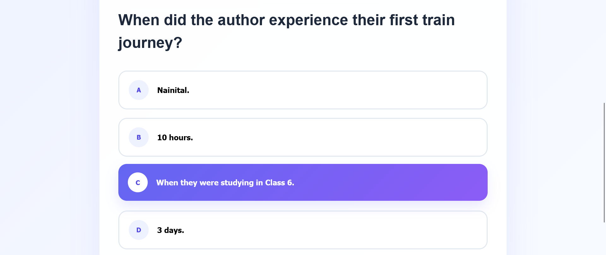
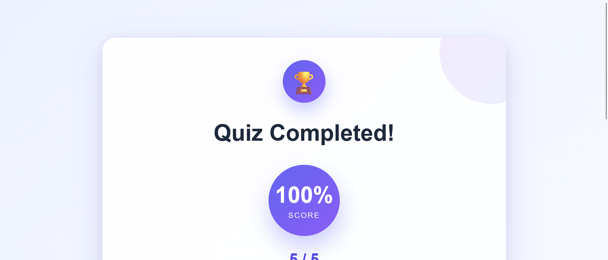
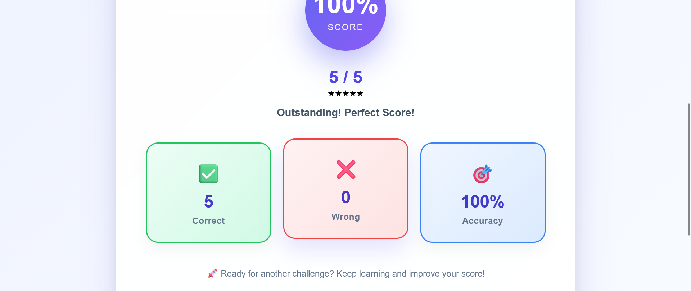

# 🧠 FlashMind AI

An AI-powered Study Assistant that transforms any study topic or notes into interactive flashcards and quizzes using Google's Gemini AI.

This project was developed as part of a **Frontend Internship Assignment** to demonstrate React development, AI integration, structured data handling, error handling, and interactive UI design.

---

## 📌 Features

- 🤖 Generate AI-powered flashcards from any study topic or notes
- 📚 Interactive flashcards with flip animation
- 📝 Take automatically generated multiple-choice quizzes
- 🔄 Retest incorrectly answered questions
- 📊 Track quiz progress and score
- 🏆 Beautiful results dashboard with performance statistics
- ⚡ Loading, error, retry, and empty states
- 🛡 Handles invalid AI responses gracefully
- 🎨 Modern and clean UI with smooth animations

---

## 🛠 Tech Stack

### Frontend
- React
- React Hooks
- React Router DOM
- CSS3
- Vite

### Backend
- Node.js
- Express.js

### AI
- Google Gemini API

---

## 📂 Project Structure

```text
FlashMind-AI/
│
├── client/
│   ├── src/
│   │   ├── assets/
│   │   ├── components/
│   │   ├── pages/
│   │   ├── services/
│   │   ├── styles/
│   │   ├── App.jsx
│   │   └── main.jsx
│   └── package.json
│
├── server/
│   ├── routes/
│   ├── controllers/
│   ├── services/
│   ├── app.js
│   ├── server.js
│   └── package.json
│
└── README.md
```

---

# 🚀 Installation & Setup

## 1. Clone the repository

```bash
git clone https://github.com/YOUR_USERNAME/FlashMind-AI.git
cd STUDY_ASSISTANT
```

---

## 2. Install dependencies

### Frontend

```bash
cd client
npm install
```

### Backend

```bash
cd ../server
npm install
```

---

## 3. Configure Environment Variables

Create a `.env` file inside the **server** folder.

```env
GEMINI_API_KEY=YOUR_GEMINI_API_KEY
PORT=5000
```

---

## 4. Start the Backend

```bash
cd server
npm start
```

---

## 5. Start the Frontend

```bash
cd client
npm run dev
```

Frontend runs on:

```text
http://localhost:5173
```

Backend runs on:

```text
http://localhost:5000
```

---

# 📖 Usage

1. Enter any study topic or paste your notes.
2. Click **Generate Flashcards**.
3. The backend sends the request to the Gemini API.
4. AI returns structured JSON containing flashcards.
5. Study using interactive flashcards.
6. Start the quiz.
7. View your score and performance.
8. Retest only the incorrectly answered questions.

---

# 🤖 AI Usage Note

This application uses **Google Gemini AI** to generate structured flashcard data.

The backend securely communicates with the Gemini API and instructs the model to return structured JSON instead of free-form text.

During development, AI tools such as ChatGPT were used for:
- Brainstorming UI ideas
- Debugging React components
- CSS improvements
- Understanding implementation approaches

All application architecture, feature implementation, integration, testing, debugging, and final code customization were completed by the developer.

---

# ⚠ Handling AI Output

One of the primary goals of this assignment was handling unreliable AI responses.

This application handles:

- Invalid or malformed JSON
- Unexpected response structure
- Empty flashcard data
- API failures
- Network errors
- Slow responses
- Loading states
- Retry functionality
- Error messages instead of application crashes

The application validates responses before rendering them, ensuring a stable user experience.

---

# 📱 Mobile Responsiveness

The application is primarily optimized for desktop usage.

The layout adapts reasonably across different screen sizes, with further mobile responsiveness planned as a future enhancement.

---

# 🔒 API Security

The Gemini API key is **never exposed to the frontend**.

All requests are routed securely through an Express backend using environment variables.

---

# 🚧 Known Limitations

- Quiz questions are generated from AI-generated flashcards.
- Requires an active internet connection.
- Depends on Gemini API availability.
- Study sessions are not saved after refreshing the page.
- Mobile responsiveness can be further improved.

---

# 🚀 Future Improvements

- Full mobile optimization
- Dark mode
- Save study sessions
- User authentication
- Export flashcards as PDF
- Study analytics
- AI-generated diagrams
- Voice input support
- Quiz timer
- Keyboard shortcuts

---

# ⏱ Time Spent

Approximately **8 hours**.

Time was spent on:

- Project setup
- Backend development
- Gemini AI integration
- Prompt engineering
- Flashcard generation
- Quiz implementation
- Error handling
- UI/UX design
- Testing and debugging

---

# 🎥 Demo

A short screen recording demonstrating the application's functionality is included with the submission.

---

# 📸 Screenshots

You can add screenshots here after uploading them.

Example:

```markdown
## Home



## Flashcards



## Quiz



## Results


```

---

# 👩‍💻 Author

**Kshithija Yatham**

B.Tech Computer Science and Engineering

FlashMind AI (Study Assistant)

FLAM Assignment

---

# 📄 License

This project was created solely for educational purposes and as part of a Frontend Internship Assignment.